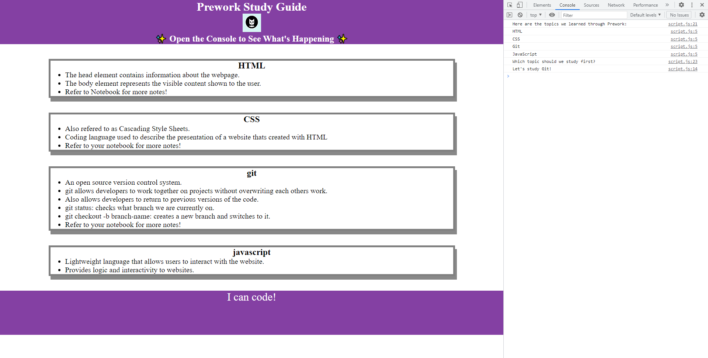

# <Rick's prework study guide>

## Description

This is a small study guide to help organize notes and practice my newly learned skills in coding. This will help me with my journey through learning these new languages and help keep things neat and organized. I learned everything from simple markdown to javascript learning HTML and CSS along the way.
## Table of Contents (Optional)

- [Installation](#installation)
- [Usage](#usage)
- [Credits](#credits)
- [License](#license)

## Installation

N/A

## Usage
- Open the command terminal on your browser
- Refresh the page to show a different topic to study each time
- Study away!

## Credits

Rick Welte -Beginner Dev

## License

Please refer to the license in repo.

## Features

Console randomizes topics to review and study.

